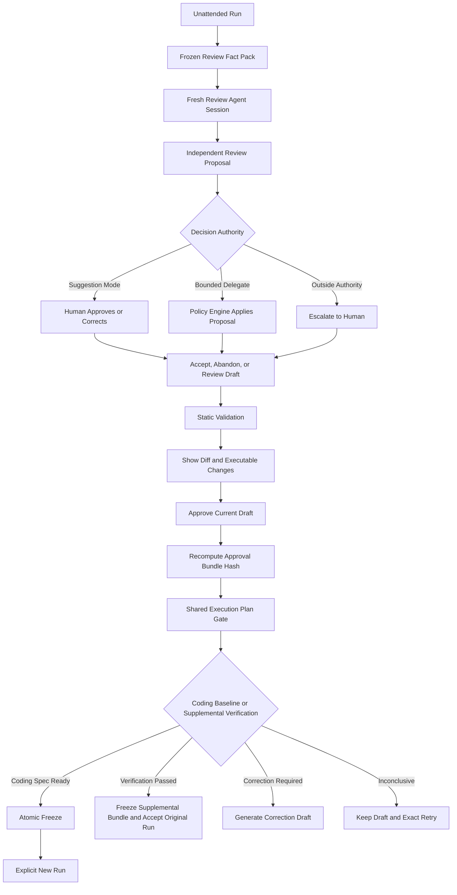

# PRD：voidtech-loop 二期 Agent-first Review

- **日期**：2026-07-16
- **状态**：Final（2026-07-16 二轮评审复核通过）
- **一期基线**：`voidtech-loop 0.2.0`，HEAD `68cbad3`
- **摘要**：二期把 developer feedback loop 从“人完成全部评审劳动”改为“独立审查 agent 完成分析和提案，确定性权限层决定是否需要人”。审查 agent 使用全新 session，只读取冻结 Goal Spec、candidate diff、全部持久化轮次与 evidence，不修改旧 run、不继续编码。默认建议模式由人批准或纠正最终建议；有界委托模式只有在审查质量达到量化门槛后开放，并且只能在机器可验证的授权包络内自动 Accept 或生成下一份可启动规格。新 run 永不自动启动。

## 1. 背景与问题

一期完成了 Agentic coding loop：不可变 Goal Spec、确定性控制器、隔离 worktree、checkpoint、指定 commit eval、预算、失败终态和人工 accept 已经成立。二期要解决的是 run 边界上的 developer feedback，而不是继续增加 worker 重试能力。

人当前通常具有 context advantage，但这不等于每次技术评审都必须由人亲自执行。一个全新审查 session 如果取得冻结规格、代码 diff、轮次、eval 和 evidence，通常能比临时浏览报告的人更系统地检查：

- 实现是否偏离冻结目标；
- eval 是否遗漏了规格要求；
- 是否出现 eval gaming；
- API、数据格式与行为是否兼容；
- evidence 是否足以支撑结论；
- STOPPED 后应改变工程路径还是产品方向。

二期的核心问题因此改写为：**怎样让独立审查 agent 承担评审劳动，同时让方向权、否决权、安全授权和新 run 启动权仍属于人。**

## 2. 当前事实基线

以下能力在一期代码中**不存在**，均为二期新地基，不得在验收或计划中写成“继续满足”：

- Decision Record；
- Review Operation Journal；
- review draft 与 `draft_hash`；
- per-run review lock 与锁内 compare-and-write；
- Feedback Pack；
- Revision Bundle 与跨资产原子冻结；
- `decided_by` / `authorization`；
- Goal Spec v2 与 `agent_review`；
- 规范化 Execution Plan 与独立 Delegation Grant；
- Review Fact Pack；
- Review Proposal；
- 有界委托的 authority gate。

一期真实行为是：

- `accept` 只允许 `EVALS_PASSED -> ACCEPTED`，并写入 `accepted_at`；
- Goal Spec schema 使用 `additionalProperties: false`，`schema_version` 固定为 `1`；
- `--allow-shell` 是当前进程的一次性布尔开关，不落盘、不绑定完整执行内容；`shell: false` 的 argv 命令同样可以执行仓库代码；
- 运行数据主要服务控制器与交接报告，没有审查输入体积预算和质量基准。

架构审查要求的 `resolveCommit / withEphemeralWorktree` 与 `tests/helpers.mjs` 已在 `68cbad3` 完成，不再是二期功能编码前置阻断。

## 3. 核心原则

> 人保留方向权和否决权，但不必亲自完成评审劳动。只有人掌握模型没有的上下文，或决定超出冻结授权边界时，才把人拉进闭环。

派生原则：

1. **Fresh reviewer**：执行代码的 worker 不得评价自己的产物。
2. **Proposal 不是 decision**：审查 agent 只输出结构化建议，控制器才有状态与冻结权限。
3. **Authority 优先于 confidence**：是否升级给人由权限和上下文边界决定，不由模糊的“模型置信度低”决定。
4. **结构完整性不冒充语义完整性**：系统能证明 Pack 内 `apply` 项均已映射，不能证明模型抽取了人的全部真实意图。
5. **安全授权绑定精确内容**：所有批准、Execution Plan、validation 与冻结绑定精确 hash；argv 不因绕过 shell 解析而获得更低权限等级。
6. **旧执行事实不可变**：Revise 和 Abandon 不修改旧 run；Accept 只保留一期既有状态转换。
7. **新 run 永不自动启动**：建议模式和有界委托都只产出显式启动命令。
8. **执行健康与评审健康分离**：Decision Record 缺失不能单独证明 run 损坏；报告分别呈现 `run_integrity` 与 `review_integrity`。

## 4. 目标用户与场景

### 4.1 目标用户

- 使用 voidtech-loop 推进可机器验收任务的工程师；
- 需要系统检查技术完整性，但不希望每次亲自浏览全部 diff 与日志的资深开发者；
- 负责判断何时可以把技术性反馈委托给 agent 的项目维护者。

### 4.2 主场景

1. `EVALS_PASSED` 后，独立 reviewer 检查 candidate 与 eval 覆盖，建议 Accept。
2. `EVALS_PASSED` 但 eval 没覆盖公共 API 兼容性，reviewer 直接生成补强后的 Goal Spec。
3. `STOPPED(exhausted)` 后，reviewer 判断目标未变，只需改变工程实现路径并生成下一规格。
4. `STOPPED(blocked)` 后，reviewer 识别 protected path、权限或 evidence 缺口并建议 Revise 或 Abandon。
5. v1 的 manual review 实际可由代码/evidence 检查，reviewer 建议迁移为 eval 或 agent review。
6. 后续 external feedback seam 可复用同一 Pack/Spec 编译链；真实性、代表性与采纳价值始终升级给人，但独立导入流程不在二期交付范围。

## 5. 产品承诺

> voidtech-loop 在每次无人值守 run 结束后，以独立的新审查 session 读取冻结规格、代码和全部可用证据，直接产出接受建议或下一份可启动规格。确定性权限层决定 agent 是否有权落决定；人只处理方向性分歧、专有上下文、越权事项和新 run 的显式启动。

不承诺：

- 审查 agent 一定理解人的全部意图；
- Review Proposal 等价于人工签字；
- hash 能证明 reviewer 身份或判断正确；
- 有界委托能处理产品方向、taste、法律、隐私或真实用户代表性；
- 二期支持多代 run 自动连续推进。

## 6. 核心流程



Review Agent 可以由用户显式调用 `/voidtech-loop:review <runId>` 启动；未来允许在启动 run 时预授权“终态后自动生成建议”，但不得在未声明时增加模型调用成本。

## 7. 三种授权级别

### 7.1 建议模式

二期默认模式：

- Review Agent 完成全部分析、证据引用和规格草稿生成；
- 人只批准、纠正方向或放弃；
- 无歧义时只需一次最终操作；
- 新 run 仍需显式启动。

建议模式允许审查 v1 和 v2 run。

### 7.2 有界委托模式

二期第二阶段能力，只有满足 §13 的质量门后才开放：

- 用户启动 review session 时提供一次性、在 reviewer 运行前冻结并 hash 绑定的 Delegation Grant；
- 允许的 outcome、字段变化、追加数量、预算、时效与 Execution Plan hash 都必须可机械检查；
- Review Agent 仍只输出 proposal，控制器依据 Delegation Grant 自动落 Decision 或 Revision；
- 不允许自动启动新 run；
- Phase 2 只对 v2 run 开放有界委托。

最严字段语义：

- 既有 `evals` 按 `id` 对齐后，规范化形式必须逐字节一致；
- 既有 `agent_review` 按 `id` 对齐后，规范化形式必须逐字节一致；
- 既有 `manual_review` 和 `out_of_scope` 数组必须逐字节一致；
- `goal_id`、`task`、`budgets`、`setup`、`protected_paths`、`review_policy` 必须逐字节一致；
- `base_commit` 只能由控制器设置为授权的 candidate 或最后 checkpoint；
- `provenance` 只能由控制器根据 parent run 与 Feedback Pack 草稿的 content hash 生成，agent 不能自由改写；发布时只验证，不重生成；
- 只允许在授权上限内追加新的 eval 或 agent review；
- 改 timeout、repeat、cwd、expected_exit、environment/network/filesystem policy、command、role 或 shell/argv kind 均属于修改，不是追加；
- 修改既有条目必须升级给人。
- 父 Goal Spec 中规范化形式完全未变的 Execution Plan，只有在 grant 明确允许 `inherit_parent_plans` 时才可复用；任何新增或修改的 argv、shell、setup、cwd、timeout 或执行策略都会生成新 plan hash，必须精确出现在 grant 中，否则升级给人。
- Phase 2 不支持程序名、前缀、正则或通配符 allowlist；`node --test`、`npm test` 等仍执行仓库代码，不构成安全沙箱。

Phase 2 的 delegate eligibility 是封闭集合：v2 run、状态为 `EVALS_PASSED`、Fact Pack coverage 为 `complete`、无待办 `manual_review`（或结果已由人录入）、所有 required `agent_review` 已 pass、proposal 与 Execution Plan 完全位于冻结 grant 包络内。eligibility 由独立确定性分类器判断，review agent 不能在看过 case 后自行声明。任一条件不满足都升级给人。

有界委托对一期“接受由人执行”的承诺作有意但默认关闭的修订：只有 Goal Spec 明确 opt-in、终态后再创建一次性 Delegation Grant、并且 §13.3 质量门已触发发布开关时，agent 才能自动落 Accept/Revise。三者缺一仍是建议模式。

### 7.3 连续自治模式

不进入二期。多 run 预授权链需要额外解决跨代目标漂移、总预算、eval gaming 累积和 supersedes，不得以有界委托的简单循环替代。

## 8. Decision Authority

必须升级给人：

- 改变产品目标、task 或成功标准；
- 删除、替换、修改或弱化既有 target/invariant；
- 修改 out-of-scope；
- 删除或自动通过 manual review；
- 判断 external feedback 是否真实、典型或值得采纳；
- 涉及隐私、法律、安全或不可逆外部影响；
- 多个合理方向会形成不同产品；
- 依赖未提供的用户、组织或历史上下文；
- 真正依赖 taste、身份或物理世界观察；
- 新增或改变未经精确 plan hash 授权的 setup、shell eval 或 argv eval；
- 超预算、扩权限或启动新 run。

通常可由 Review Agent 判断：

- eval 覆盖不足；
- 测试遗漏；
- 实现偏离冻结规格；
- API 或数据格式兼容性风险；
- evidence 缺失、截断或矛盾；
- 将冻结规格中的明确要求补成新的 eval 或 agent review；
- 收紧验证但不修改既有条目；
- STOPPED 后调整工程实现路径。

## 9. eval、agent_review 与 manual_review

| 类型 | 适用条件 | 执行者 | 是否参与 `EVALS_PASSED` |
|---|---|---|---|
| `eval` | 可机械、可重复、命令化验证 | 确定性 eval runner | 是 |
| `agent_review` | 需要语义判断，但 reviewer 可取得完整上下文 | fresh Review Agent | 否 |
| `manual_review` | 依赖人专有上下文、taste、身份或现实世界观察 | 人 | 否 |

兼容 v1 时不重解释旧字段。Review Agent 可以建议把 v1 manual review 转成 eval 或 agent review，但只有人批准的新 v2 spec 才能完成迁移；有界委托不得自动删除或转换既有 manual review。

## 10. 用户路径

### 10.1 Accept

- Review Agent 建议 Accept，并列出依据与限制；
- 建议模式下人一次确认；
- 有界委托仅在 `EVALS_PASSED`、无未完成人工项、覆盖状态完整且授权允许时自动 Accept；
- 保留一期 `EVALS_PASSED -> ACCEPTED`；
- 生成独立 Decision Record，不伪装为人工身份认证。
- 无 `manual_review` 时仍保持一期一步接受；存在人工项时只填写规格明确声明的项目，不追加反馈分类表单。
- 人不同意 agent 建议时，可以直接作出相反的人工 Decision，或附方向意见要求 reviewer 最多重提案一次；两条路径都保留原 proposal，不回写 agent 结果。
- CLI 保留 `loop accept <runId>`；从 review 摘要触发时调用同一业务操作，不另造 Accept 表单。

### 10.2 Abandon

- Review Agent 可以建议 Abandon；
- 二期不允许 agent 自动 Abandon；
- 人一次确认，理由可选；
- run state 不修改，独立追加 Decision Record；
- 已 Abandon 后 Phase 2 不允许 Revise。
- 新增最小人工直达命令 `loop abandon <runId> [--reason <text>]`；reason 可选，不要求先运行 reviewer 或生成 Feedback Pack。

### 10.3 Revise

- Review Agent 不要求用户先描述问题，直接从事实生成 findings、Feedback Pack 与新 Spec 草稿；
- 批准界面并列展示原始规格/反馈、规格变化摘要、未映射内容、完整命令变化与可展开 diff；
- 建议模式的人批准“当前展示版本”；系统内部绑定完整 `approval_bundle_hash`，正常界面不要求人阅读 hash；
- 有界委托由 authority gate 对同一个 Approval Bundle 自动批准；
- 纯静态 validator 必须先于任何代码执行；
- Approval Bundle 同时覆盖 Feedback Pack 草稿、Goal Spec 草稿、base commit、完整 Execution Plan、可选 Delegation Grant、来源 evidence 快照和预计验证计划；任一内容变化都产生新草稿版本并使旧批准失效；
- shared Execution Plan gate、验证、二次 bundle hash match 与原子冻结按技术设计执行；
- coding revise 只输出新 run 的显式启动命令；verification-only revise 走下述独立分支。

#### 10.3.1 验证型 Revise

当草稿只追加 eval，并且不改变产品行为、目标、既有 target/invariant、out-of-scope、setup、实现要求或其他既有规范化字段时，确定性分类为 `verification-only`：

```text
EVALS_PASSED
  -> Supplemental Verification Draft
  -> Approve Current Bundle
  -> Run Supplemental Verification on Original Candidate
       -> verification_passed      -> Accept Original Run
       -> correction_required      -> Generate Correction Spec
       -> verification_inconclusive -> Keep Draft, No Accept, No Start
```

- `verification_passed`：冻结补充 Goal Spec v2 与验证证据，不创建新 run ID、不调用 coding agent，回到原 run 的 Accept 路径；Decision Record 同时引用原 `goal_hash` 与补充验证 hash，并明确表述“原 candidate 通过补充验证”，不得声称旧 Goal Spec 被修改；
- `correction_required`：candidate 成为新 coding spec 的 base，失败的补充验证成为新 target；因为它在 base 上失败，首轮不得自动提升为 invariant。新 run 仍执行一期完整 baseline 与状态创建；
- `verification_inconclusive`：timeout、环境错误、证据缺失或验证基础设施故障不解释为代码缺陷；不 Accept、不生成启动命令，保留草稿与诊断并允许精确重试。只有验证内容、Spec、Pack、base 或命令变化才需重新批准；
- 一期 coding baseline 的 `all_targets_met` 拒绝启动语义保持不变；同一事实在 supplemental verification 中解释为 `verification_passed`，两者不得共用“是否创建 coding run”的控制分支。

#### 10.3.2 一次批准的交互契约

用户默认看到草稿版本、来源 run、规格变化摘要、原始反馈/意图、未映射内容和所有可执行命令变化；hash 只在审计区展开。CLI 形态：

```text
/voidtech-loop:approve review-draft-v3 --approve-execution
```

该操作表示：批准当前展示版本的规格变化，并授权系统只对该精确版本执行已展示的 Execution Plan；验证通过后可以原子冻结对应 Pack 与 Spec，但不得自动启动新 run。系统必须先重算并匹配 `approval_bundle_hash`，再进入 shared execution gate。shell plan 额外显示高风险提示，但 argv plan 不能绕过授权。语义验证失败生成新草稿；基础设施失败保留原草稿精确重试；bundle 不匹配则拒绝并重新展示，不沿用旧批准。

机器只保证 Feedback Pack 内每个 `apply` item 已映射或明确阻断，不能证明它从自然语言中抽取了全部意图。批准视图必须并列展示原始反馈/规格要求、生成的规格变化和未映射内容；完全未被抽取的意图只能由人通过这组对照发现。

#### 10.3.3 review 状态与重入

| run / review 状态 | `/review` | Accept | Abandon | Approve draft |
|---|---|---|---|---|
| 非终态 | 拒绝 | 拒绝 | 拒绝 | 拒绝 |
| 终态、未决 | 每个 run 只允许一个活动 session；相同 frozen input 可复用 Fact Pack | 依一期条件 | 允许 | 允许当前活动草稿 |
| 已 Accept | 返回已有决定 | 幂等返回 | 冲突拒绝 | 拒绝 |
| 已 Abandon | 返回已有决定 | 冲突拒绝 | 幂等返回 | Phase 2 拒绝 Revise |
| 已 Revise | 返回已有决定与新规格 | 冲突拒绝 | 冲突拒绝 | 相同 bundle 幂等返回 |

活动 session 失败可重试 reviewer，但必须显示是否复用 Fact Pack 及新增模型成本；已冻结 proposal 不因重试被覆盖。

#### 10.3.4 执行健康与评审健康

- `EVALS_PASSED` / `STOPPED` 没有 Decision Record 是合法未决状态，不能据此判损坏；
- 没有 `review_protocol_version` 或 `decision_ref` 的历史 `ACCEPTED` 按 `legacy_accepted` 读取，不迁移、不补造 Decision Record；
- 新协议 `ACCEPTED` 有 `decision_ref` 但 Record 缺失时，`run_integrity` 仍按冻结 spec、rounds、evidence 单独判断，`review_integrity` 标记损坏并 fail closed；
- Abandon/Revise 的 committed Decision 不修改旧 run state 或 checksum；
- 同一 run 出现冲突 finalized decision 时只阻断 review 层并要求人工排障，不把旧 run 执行资产连带判坏。

### 10.4 External feedback（后续阶段 seam）

仅在用户主动导入时进入：

- Review Agent 可做来源摘要、结构化和规格映射；
- 来源真实性、典型性、采纳价值与脱敏决定必须由人负责；
- 必须生成 Feedback Pack；
- 不进入普通终态 review 固定路径；
- 不开放网络连接器、生产采集或 A/B 执行。
- 二期只定义 Feedback Pack 的来源字段与人工导入 seam，不承诺交付独立 external feedback 命令；不纳入二期质量指标和里程碑。

## 11. 范围内 / 范围外

### 11.1 二期范围内

- Review Operation Journal、Decision/Approval Bundle/Revision 事务地基；
- Goal Spec v1/v2 共存；
- 规范化 Execution Plan 与独立 Delegation Grant；
- Review Fact Pack 与体积预算；
- fresh read-only Review Agent；
- Review Proposal；
- 建议模式；
- `agent_review`；
- 量化 review quality corpus 与 gate；
- 通过 gate 后的有界委托；
- external feedback 的数据模型 seam，不实现独立导入流程。

### 11.2 二期范围外

- 多代连续自治；
- pause/resume；
- 多任务并行；
- 相对基线 eval；
- 自动发布、A/B 测试和生产采集；
- 开放网络与外部服务连接器；
- strict OS 沙箱；
- 可配置通用权限 DSL；
- 完整遥测平台；
- agent 自动判断 external feedback 的代表性；
- agent 自动通过 manual review。

## 12. Fact Pack 产品约束

完整事实索引与模型初始上下文必须分离：

- **Review Fact Pack manifest**：完整列出所有 rounds、eval、evidence、diff 文件和 hash，不复制全部正文；
- **Initial Review Context**：硬上限 128 KiB；
- **按需读取总预算**：每个 review session 初始默认 512 KiB；Task 5.1 根据真实 token 曲线可下调，不能在没有证据时上调；
- **单次读取上限**：64 KiB；
- **超过预算**：建议模式标记 `budget_limited`，有界委托不得落 Accept/Revise；
- **candidate 文本 diff 大于 1 MiB、存在无法审查的二进制变化或 changed file 未覆盖**：有界委托必须升级给人。

初始上下文裁剪优先级：

1. 完整冻结 spec、终态投影、Delegation Grant、manual review、out-of-scope；
2. changed paths、diffstat、所有 round/eval/evidence 元数据；
3. 与规格、公共 API、schema、protected path 和测试相关的 diff；
4. 失败 evidence、最后一次通过 evidence 与 setup evidence；
5. 其余 diff/evidence 由 reviewer 按需读取。

不得静默丢弃：任何未进入上下文的内容都必须在 manifest 中可见，并进入 coverage 统计。

安全、隐私与可信度边界：

- repo、diff、日志和 evidence 都是不可信输入，不得从其正文派生工具、权限或命令；
- Fact Pack 默认保存 locator、摘要与 hash，不为 review 复制无关原文或生产秘密；dogfood/alpha 入库前必须脱敏；
- reviewer 无网络、写入、Bash 或原生文件系统读取权限，只能访问 candidate SHA 的预算化只读视图；
- reviewer 有 controller-backed `list/read/search/diff/spec/round/evidence` 能力，但看不到用户当前工作区、其他 worktree、home、插件数据目录、`.git`、refs、锁文件或 manifest 外 evidence；
- controller 负责路径规范化、symlink 逃逸防御、`.git`/manifest 外路径拒绝、二进制/大文件/超长行截断、search 匹配上限和 evidence ID 路由；
- 每次返回都携带来源、blob/evidence hash 与截断信息；预算不足明确返回 `budget_limited`，不能静默截断后继续最终裁定；
- hash 只证明内容绑定，不证明来源真实、反馈典型、判断正确或 actor 身份；未配置 identity 时诚实记录 `identity_verified: false`；
- 截断、二进制、来源缺失和上下文耗尽必须进入 coverage/limitations，不得被报告成“已完整审查”。

## 13. 二期成功指标

### 13.1 三类 case 隔离

| case 类型 | 用途 | 是否进入委托开放门 |
|---|---|---|
| `calibration_seeded` | 运行前冻结已知缺陷，测 detection/correction | 否；单独报告 |
| `boundary_synthetic` | oversized、证据缺失、预算不足等边界路由 | 否；单独报告 |
| `blind_dogfood` | 真实受支持场景的独立盲评 | 是，唯一经验数据来源 |

seeded 标签必须在执行前冻结，不能看到 agent 结果后分类。boundary case 的正确结果可以是 `budget_limited` 或 `escalate`；真实 blind dogfood 如果在声明支持范围内出现 `budget_limited`，计为 coverage 失败。确定性安全测试仍是发布硬门，但不能混进经验质量分母美化结果。

### 13.2 Blind dogfood 指标

```text
eligible_coverage =
  自动给出结论的、合格且 in-envelope 的 blind dogfood
  / 全部合格且 in-envelope 的 blind dogfood

material_override_rate =
  经裁定需实质修改的 agent 结论
  / 自动给出结论的合格 blind dogfood

must_escalate_recall =
  正确升级的必须人工裁定 blind dogfood
  / 全部必须人工裁定 blind dogfood
```

support envelope 必须在揭示前按 delegate eligibility、diff/evidence 体积、二进制变化和可用来源机械冻结。`critical miss` 指参考评审与 adjudication 确认存在会阻断 Accept、要求方向升级或触及安全边界的问题，而 agent 给出 Accept/自动 Revise 且未升级。

另行公开原始计数：`critical_miss_count`、`out_of_envelope_rate`、`budget_limited_in_envelope_count`、`contaminated_case_count`、seeded detection/correction、boundary routing correctness，以及过度保守的非必要升级率。若 must-escalate 分母为 0，不得把 recall 记为 100%，质量门保持证据不足。

`delegate_eligible_rate` 作为 alpha 观察指标单独报告，不设预设发布阈值，也不得为提高比例而放宽 grant 或 Execution Plan 精确授权。eligibility 只由冻结 grant 和独立分类器决定。

### 13.3 有界委托开放门

Phase 2 默认只开放建议模式。低风险委托自动落决定只有在以下条件全部满足后，才作为独立发布动作开启；功能代码完成不等于开放：

- 至少 30 个合格、未污染的 `blind_dogfood`；
- `eligible_coverage >= 80%`；
- `material_override_rate <= 5%`；
- `must_escalate_recall = 100%`，且分母非 0；
- `critical_miss_count = 0`；
- `budget_limited_in_envelope_count = 0`；
- 所有纳入、排除、out-of-envelope 与污染 case 可审计；
- authority gate、Execution Plan 授权、Review Operation Journal 恢复、锁内 compare-and-write、决策冲突、原子冻结与 prompt injection 的确定性测试全部通过。

80% 只是效率门；零 critical miss、完整升级召回和较低实质纠正率才是安全门。任一条件未达，只继续 suggestion/shadow。

## 14. 验收矩阵

| # | 验收项 | 可判定结果 |
|---|---|---|
| P2-01 | 新事务地基 | Review Operation Journal、Decision Record、Approval Bundle conditional hash match、Revision Bundle 均从不存在到有行为测试 |
| P2-02 | v1 hash 兼容 | Task 2.1 建立的 YAML golden fixture 经完整 parser/validator 后，规范化内容和 `goal_hash` 逐字节不变 |
| P2-03 | v1/v2 共存 | v1 不接受 v2 字段；v2 由独立 schema/validator 路由；旧 run 可读可 accept |
| P2-04 | Execution Plan | setup、shell 与 argv 都进入 canonical plan；完整 plan hash、candidate 与执行策略绑定精确授权 |
| P2-05 | fresh reviewer | review session 与 worker session 不同，不读取 worker 私有对话 |
| P2-06 | read-only | reviewer 无法修改 repo、run、state、evidence 或直接执行 decision |
| P2-07 | Fact Pack 预算 | 初始、单次和累计预算可机械测试，裁剪顺序稳定 |
| P2-08 | coverage 限制 | `budget_limited`、未审查文件或二进制变化会阻断有界委托 |
| P2-09 | Proposal/Decision 分离 | agent 输出无法绕过 authority gate 成为 finalized decision |
| P2-10 | 最严追加语义 | 既有条目按 id 对齐后规范化字节完全不变，只允许追加 |
| P2-11 | manual honesty | agent 不能写入 manual review passed |
| P2-12 | 安全顺序 | 人/Delegation Grant 批准当前 Approval Bundle 前不运行 setup、shell/argv eval 或 validation |
| P2-13 | approval bundle conditional match | 批准绑定 Pack、Spec、base、Execution Plan、evidence 快照与验证计划；验证期间任一内容变化会使结果作废且不冻结 |
| P2-14 | 原子冻结 | 故障注入下不会只留下 Pack 或 Spec |
| P2-15 | 幂等冲突 | 相同决定返回已有记录；冲突决定拒绝；first finalized decision wins |
| P2-16 | no auto-run | 建议和委托模式都只返回显式启动命令 |
| P2-17 | 质量门 | §13 每项指标有 corpus、原始计数和通过/不通过结论 |
| P2-18 | verification-only pass | 补充验证全部通过时不创建 run ID、不调用 `startLoop`，并回到原 run Accept |
| P2-19 | baseline 语义隔离 | coding baseline 的 `all_targets_met` 仍拒绝启动；supplemental verification 将其解释为成功 |
| P2-20 | verification correction | 补充验证失败会生成以原 candidate 为 base、失败检查为 target 的修复型草稿，不自动设为 invariant |
| P2-21 | verification inconclusive | 补充验证失败或不确定时不能 Accept；不确定允许精确重试且不生成启动命令 |
| P2-22 | 双规格追溯 | Accept 报告同时引用原始 goal hash、补充验证 hash、candidate commit 与验证结果 |
| P2-23 | 盲评时序 | 仅 `reference_locked_at < agent_result_revealed_at` 且未污染的预登记 case 可进入委托指标 |
| P2-24 | integrity 分离 | 缺失 Decision Record 不单独破坏 run；报告分别输出 `run_integrity` 与 `review_integrity` |
| P2-25 | Operation Journal 恢复 | prepared/committed Accept、Abandon、Revise 的恢复矩阵可故障注入验证，legacy Accept 不补造 Record |
| P2-26 | 锁内 compare-and-write | 同 run 决策串行、不同 run 可并行；checksum 不匹配返回 `state_changed`，不覆盖新 state |
| P2-27 | snapshot retrieval | reviewer 只能经 controller API 读取 candidate snapshot；路径/symlink/`.git`/预算越界均拒绝或明确 limitation |
| P2-28 | grant 单一来源 | Delegation Grant 在 reviewer 前冻结；Decision Record/Feedback Pack 只引用 grant ID/hash，不复制 allowlist 或 limits |
| P2-29 | eligibility 独立 | eligibility 只由冻结 grant 与确定性分类器产生；agent 自报值无效，eligible rate 仅作 alpha 观察 |
| P2-30 | 人工纠正路径 | 人可直接落相反的人工 Decision，或附方向意见要求 reviewer 重提案且最多一次；两条路径均保留原 proposal，不回写 agent 结果 |

## 15. Dogfood / Alpha 计划

### 15.1 Corpus 组成与预登记

- `blind_dogfood`：终态 run 在 agent review 前自动登记，冻结 case 类型与支持范围；包含真实成功与 STOPPED run；
- `calibration_seeded`：eval gaming、compatibility break、evidence gap、authority boundary、prompt injection；标签和预期问题在执行前冻结；
- `boundary_synthetic`：oversized diff/rounds/evidence、预算不足与来源不可读，验证路由而非结论覆盖率。

每个 case 至少记录：

```yaml
enrolled_at: 2026-07-16T12:00:00Z
reference_locked_at: 2026-07-16T12:30:00Z
agent_result_locked_at: 2026-07-16T12:40:00Z
agent_result_revealed_at: 2026-07-16T12:41:00Z
contaminated: false
```

### 15.2 参考答案

- blind case 分配交叉 reviewer；reference 必须在 agent 结果揭示前冻结；
- 已看到 agent 结论的 run 发起者不得提交盲评 reference，揭示后可参与 adjudication，但不能回写原 reference；
- 必须满足 `reference_locked_at < agent_result_revealed_at`，否则标记 `contaminated`，排除 gate 但公开计数；
- blocking finding、outcome 和 authority escalation 分开记录；
- 分歧 case 由第二人裁定，不把 agent 与单个人的分歧直接算作错误；
- reference review 也必须引用冻结事实，避免用不可追溯直觉当 gold standard。

### 15.3 发布顺序

1. suggestion-only dogfood；
2. suggestion alpha；
3. bounded delegate shadow；
4. 达到 §13.3 后小范围开放委托；
5. 未达门槛时不以“后续优化”为由上线自动决定。

## 16. 风险与退出条件

| 风险 | 退出或转向信号 |
|---|---|
| reviewer 系统性漏检 | `critical_miss_count > 0`，立即关闭委托并复盘 blind corpus |
| reviewer 过度挑错或升级 | `material_override_rate >5%` 或非必要升级持续上升，先改善质量而非增加审批 |
| 上下文预算不足 | in-envelope 出现任一 `budget_limited`，调整 Fact Pack 设计和支持包络后重新积累 blind 样本 |
| authority gate 名义机械、实际语义化 | 任何既有条目修改未升级给人，停止委托 |
| manual review 被伪装 | agent 写入人工通过结果，视为安全边界事故 |
| 用户不信 evidence | blind `material_override_rate >5%`，保持建议模式并重新设计证据面 |
| 委托价值太小 | `eligible_coverage <80%`，不建设连续自治或扩大权限 |

## 17. 已定案与开放问题

已定案：

- Agent-first review 是二期产品中心；
- 建议模式默认，有界委托门控，连续自治范围外；
- Reviewer 必须 fresh、read-only、不能直接决策；
- `agent_review` 需要 Goal Spec v2；
- 既有条目最严逐字节不变，只允许追加；
- Fact Pack 使用 manifest + 分层读取，不把全部证据一次塞入上下文；
- Review Operation Journal 与 Decision/Approval Bundle/Revision 事务地基是第一个工程里程碑；
- 执行授权统一建模为 canonical Execution Plan 与独立 Delegation Grant；
- run state 只通过 per-run review lock 内的 checksum compare-and-write 更新，不把它称为分布式 CAS；
- reviewer 只通过 controller-backed snapshot retrieval 读取 candidate SHA；
- verification-only Revise 属于 review 验证分支：通过接受原 run，失败才生成 coding run；
- 用户批准当前展示版本，系统以隐藏的 `approval_bundle_hash` 绑定完整 Pack、Spec、base、命令、evidence 与验证计划；
- 委托开放只依据预登记、未污染的 blind dogfood；seeded 与 boundary 分开报告；
- 二期首发只提供显式 `/review`，不在 run 启动时预授权终态自动 review；
- external feedback 仅保留数据模型 seam，独立导入流程移出二期；
- bounded delegate 的自动落决定是质量门触发的发布动作，不是二期必然交付承诺。

仍需在工程计划评审定案：

- Review Agent 的默认模型，以及在“单次不超过 5 分钟且成本不高于一轮 worker invocation”上限内的具体金额；待 spike 定案。

## 18. 变更记录

- 2026-07-16：初稿，确定 Agent-first review、建议模式与最严授权边界。
- 2026-07-16：补充 verification-only Revise、Approval Bundle 一次批准协议，以及预登记 blind dogfood 委托质量门；移出二期 external feedback 独立导入。
- 2026-07-16：定案 Review Operation Journal、锁内 compare-and-write、Execution Plan/Delegation Grant 与 controller snapshot retrieval。
- 2026-07-16：显式声明有界委托是对一期「接受由人执行」承诺（一期 PRD §3.2/§1.3）的有意修订——默认关闭，需 Goal Spec opt-in、一次性 Delegation Grant 与 §13.3 质量门三重显式；该边界曾是团队设定 `defaultEnabled: true` 的前提，开放委托前需团队重新确认该前提仍成立。同轮补 P2-30 人工纠正路径验收项、unsupported 裁定口径与 grant expiration claim 时刻语义；经二轮评审复核后转 Final。
